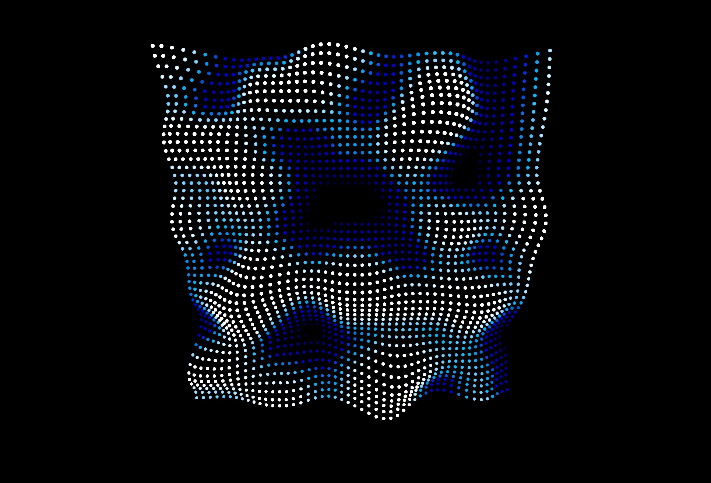

# Improved Noise with @React-Three/Fiber

This project is a React application built using React-Three-Fiber and Three.js. It visualizes an animated grid of points with organic motion and color transitions, creating a sweet effect. The animation leverages the React-Three-Fiber library's `useFrame` hook.

```
yarn
yarn dev
```



Watch the tutorial on [YouTube](https://youtu.be/vvccfr-p79o)

